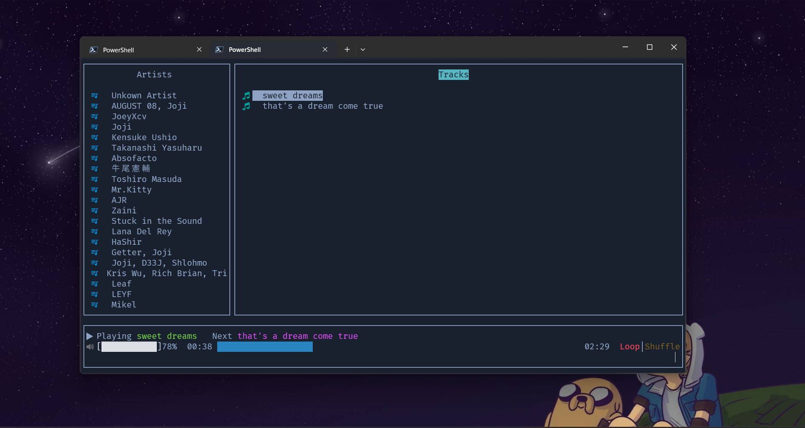
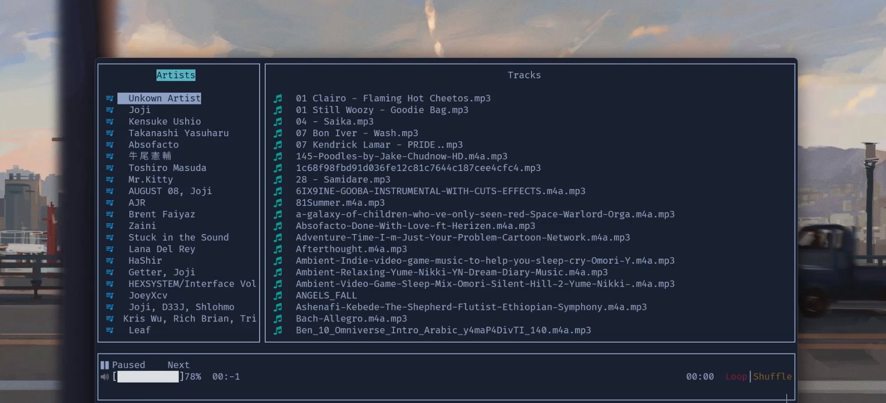

# Sonic - A Lightweight Terminal Music Player

Sonic is a fast and minimalistic terminal-based music player for Linux and Windows,
currently limited to mp3 and wav format playback using SDL audio backend.


## Features

- Play, pause, skip, and rewind tracks with simple keybindings.
- Supports looping and shuffling playlists.
- Navigate tracks using arrow keys.
- Search and play music from a specified folder using `-a /music/folder` command line option.
- Cross-platform support (Linux & Windows).

## Showcase

### Image Preview



### Video Demo

[](./asset/showcase_vid.mp4)

## Installation

> Note: if you are windows you can download the executable directly from release, sadly for Linux since i don't have access to Linux machine and WSL was hard to work with;
 i couldn't build it for Linux, so you might have to build it from source!

### Requirements

- CMake
- SDL3
- SDL3-Mixer
- FTXUI

### Build Instructions

```sh
mkdir build && cd build
cmake --build . --config Release
```

## Usage

Run Sonic with the following command:

```sh
./Sonic -a /path/to/music/folder
```

### Controls

- `p` - Play/Pause track
- `space` - Toggle playback
- `n` - Next track
- `b` - Previous track
- `i` - Increase volume
- `k` - Decrease volume
- `l` - Toggle loop
- `s` - Toggle shuffle
- `]` - Seek +5 seconds
- `[` - Seek -5 seconds
- `r` - Rewind
- `1` - Artists
- `2` - All Tracks
- `3` - Albums
- `q` - Quit


## Dependencies

Sonic uses the following dependencies:

- **SDL3** (for audio playback)
- **SDL3-Mixer**
- **FTXUI** (for terminal UI)

## CMake Configuration

Sonic uses CMake and CPM for dependency management:

```cmake
CPMAddPackage(
  NAME SDL
  GITHUB_REPOSITORY libsdl-org/SDL 
  VERSION 2.30.1
  GIT_TAG main
  OPTIONS "BUILD_SHARED_LIBS OFF"
)

CPMAddPackage(
  NAME FTXUI
  VERSION 5.0.0
  GITHUB_REPOSITORY ArthurSonzogni/FTXUI
  GIT_TAG cdf2890
  OPTIONS
  "FTXUI_BUILD_EXAMPLES off"
  "FTXUI_ENABLE_INSTALL off"
  "FTXUI_BUILD_TESTS off"
)


```

## License

Sonic is released under the MIT License.

## Contributing

Feel free to open issues and submit pull requests!


